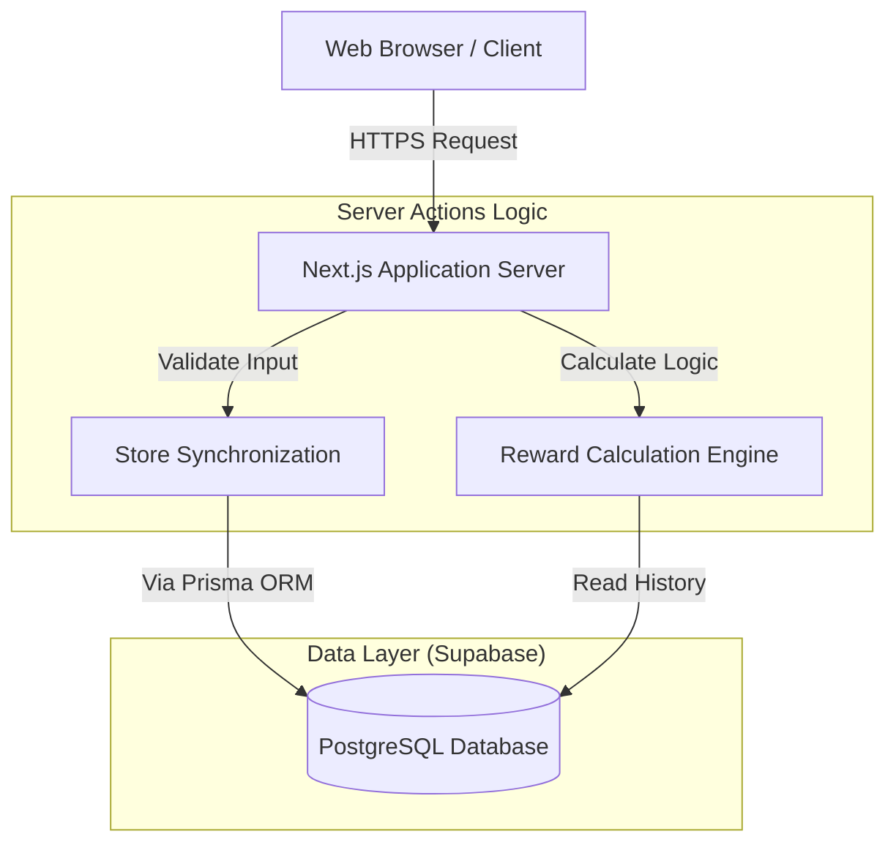

# Laporan Lengkap Sistem Aplikasi Reward

Dokumen ini disusun sebagai referensi teknis komprehensif untuk penyusunan laporan skripsi. Penjelasan mencakup Arsitektur Sistem, Desain Database, Fitur Utama, dan Alur Kerja Logis aplikasi.

---

## 1. Arsitektur Teknis Sistem

Aplikasi dibangun menggunakan teknologi web modern (*Modern Web Stack*) yang menjamin performa tinggi, keamanan tipe data, dan kemudahan pengembangan.

### 1.1 Stack Teknologi & Tools
*   **Framework Frontend & Backend**: [Next.js](https://nextjs.org/) (Versi 15+, App Router).
    *   *Alasan*: Mendukung Server Actions untuk logika backend yang aman tanpa perlu membuat API terpisah secara masif.
    *   *Role*: Menangani antarmuka (UI) dan logika bisnis (Server Side).
*   **Bahasa Pemrograman**: [TypeScript](https://www.typescriptlang.org/).
    *   *Alasan*: Meminimalisir bug saat pengembangan dengan sistem pengecekan tipe data yang ketat (*Type Safety*).
*   **Database**: [Supabase PostgreSQL](https://supabase.com/) (Cloud-Managed).
    *   *Alasan*: Skalabilitas tinggi, fitur real-time, dan manajemen koneksi yang efisien untuk serverless.
*   **ORM (Object-Relational Mapping)**: [Prisma](https://www.prisma.io/).
    *   *Alasan*: Mempermudah interaksi database tanpa query SQL manual, mencegah SQL Injection.
*   **Styling**: [Tailwind CSS](https://tailwindcss.com/).
    *   *Alasan*: Mempercepat pembuatan UI yang responsif dan konsisten.

### 1.2 Topologi Infrastruktur

---

## 2. Desain Database & Skema

Database dirancang menggunakan model relasional yang terintegrasi. File skema utama terdapat di `prisma/schema.prisma`.

### 2.1 Entitas Utama
1.  **Member** (`members`)
    *   Penyimpanan data pelanggan yang disinkronisasi.
    *   Atribut: `id`, `name`, `phone`, `totalPoints` (poin akumulatif).
2.  **Transaction** (`transactions`)
    *   Rekam jejak belanja pelanggan.
    *   Atribut: `amount` (total belanja), `pointsEarned` (poin didapat), `transactionDate`.
    *   *Relasi*: Satu member memiliki banyak transaksi (*One-to-Many*).
3.  **RewardCampaign** (`reward_campaigns`)
    *   Program undian/reward yang dibuat admin.
    *   Atribut: `criteria` (misal: belanja terbanyak), `startDate`, `endDate`.
4.  **RewardWinner** (`reward_winners`)
    *   Tabel hasil perhitungan pemenang.
    *   Atribut: `rank` (juara 1, 2, 3), `rewardClaimed` (status klaim).

---

## 3. Fitur Unggulan & Mekanisme Kerja

### 3.1 Store Synchronization (Sinkronisasi Toko)
Fitur ini menghilangkan kebutuhan admin menginput data pelanggan satu per satu.
*   **Masalah**: Input manual rentan *human-error* dan lambat.
*   **Solusi**: Sistem menarik data dari database toko (disimulasikan via dummy) dalam rentang tanggal tertentu.
*   **Algoritma**:
    1.  **Fetch**: Mengambil data mentah transaksi.
    2.  **Filter**: Memastikan data tanggal valid.
    3.  **Check**: Cek apakah Pelanggan Baru atau Lama (menggunakan ID Unik).
    4.  **Upsert**: Jika baru -> Buat Member. Jika lama -> Update data.

### 3.2 Automated Point Calculation (Hitung Poin Otomatis)
Setiap transaksi yang masuk langsung dikonversi menjadi poin berdasarkan konfigurasi sistem.
*   **Rumus**: `Poin = Total Belanja / Rate Konversi`
*   *Contoh*: Belanja Rp 50.000 dengan rate Rp 10.000 = 5 Poin.
*   **Manfaat**: Konsistensi perhitungan reward bagi semua pelanggan.

### 3.3 Dynamic Reward Campaign (Sistem Penentuan Pemenang)
Admin dapat membuat "Kompetisi" fleksibel untuk menentukan siapa pelanggan terbaik.
*   **Kriteria Dinamis**:
    1.  `Top Points`: Siapa yang poinnya terbanyak?
    2.  `Top Spending`: Siapa yang total belanjanya terbesar?
    3.  `Top Frequency`: Siapa yang paling sering datang (jumlah transaksi)?
*   **Proses**: Saat campaign dibuat, sistem melakukan *Query Aggregation* ke database untuk mengurutkan member sesuai kriteria dalam rentang waktu yang dipilih, lalu menyimpan hasilnya di tabel `RewardWinner`.

### 3.4 Data Integrity & Security
*   **Validasi**: Input tanggal dan pencarian member divalidasi di sisi server.
*   **Secure Connection**: Koneksi database menggunakan enkripsi SSL dan manajemen *Connection Pooling* (PgBouncer) untuk stabilitas.

---

## 4. Kesimpulan Implementasi

Sistem Aplikasi Reward ini berhasil mengintegrasikan proses bisnis manual menjadi sistem otomatis berbasis cloud.
1.  **Efisiensi Waktu**: Mengurangi waktu admin input data hingga 95% dengan *Store Sync*.
2.  **Akurasi**: Menghilangkan kesalahan hitung poin manual.
3.  **Transparansi**: Data pemenang dan poin tercatat rapi di database yang aman.
